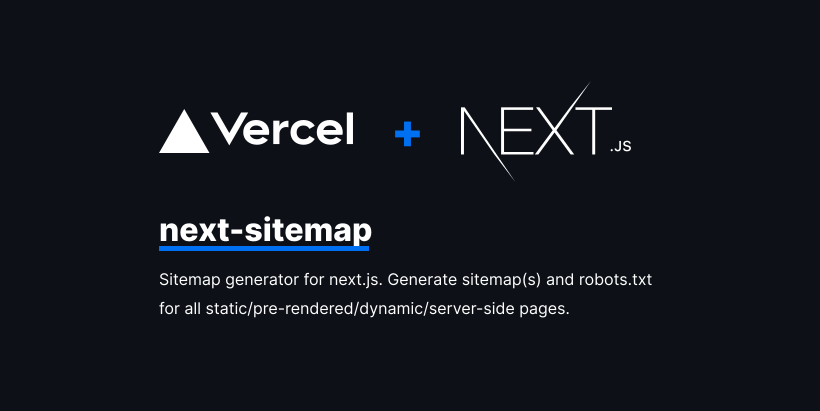

[](https://vercel.com/?utm_source=next-sitemap&utm_campaign=oss)

<div align="center">

[](https://dev.azure.com/iamvishnusankar/Public/_build/latest?definitionId=126&branchName=master)
[](https://badge.fury.io/js/next-sitemap)
[](https://github.com/iamvishnusankar/next-sitemap/pulls)
<a href="https://twitter.com/intent/follow?screen_name=iamvishnusankar">

</a>

</div>

## Table of contents

- Getting started
  - [Installation](#installation)
  - [Create config file](#create-config-file)
  - [Building sitemaps](#building-sitemaps)
- [Index sitemaps](#index-sitemaps-optional)
- [Splitting large sitemap into multiple files](#splitting-large-sitemap-into-multiple-files)
- [Configuration Options](#configuration-options)
- [Custom transformation function](#custom-transformation-function)
- [Full configuration example](#full-configuration-example)
- [Generating dynamic/server-side sitemaps](#generating-dynamicserver-side-sitemaps)
- [Typescript JSDoc](#typescript-jsdoc)

## Getting started

### Installation

```shell
yarn add next-sitemap
```

### Create config file

`next-sitemap` requires a basic config file (`next-sitemap.config.js`) under your project root

> ✅ `next-sitemap` will load environment variables from `.env` files by default.

```js
/** @type {import('next-sitemap').IConfig} */
const config = {
  siteUrl: process.env.SITE_URL || 'https://example.com',
  generateRobotsTxt: true, // (optional)
  // ...other options
}

export default config
```

### Building sitemaps

Add next-sitemap as your postbuild script

```json
{
  "build": "next build",
  "postbuild": "next-sitemap"
}
```

You can also use a custom config file instead of `next-sitemap.config.js`. Just pass `--config <your-config-file>.js` to build command (Example: [custom-config-file](https://github.com/iamvishnusankar/next-sitemap/tree/master/examples/custom-config-file))

```json
{
  "build": "next build",
  "postbuild": "next-sitemap --config awesome.config.js"
}
```

## Index sitemaps (Optional)

📣 From `next-sitemap` v2.x onwards, `sitemap.xml` will be [Index Sitemap](https://developers.google.com/search/docs/advanced/sitemaps/large-sitemaps). It will contain urls of all other generated sitemap endpoints.

Index sitemap generation can be turned off by setting `generateIndexSitemap: false` in next-sitemap config file. (This is useful for small/hobby sites which does not require an index sitemap) (Example: [no-index-sitemaps](https://github.com/iamvishnusankar/next-sitemap/tree/master/examples/no-index-sitemaps))

## Splitting large sitemap into multiple files

Define the `sitemapSize` property in `next-sitemap.config.js` to split large sitemap into multiple files.

```js
/** @type {import('next-sitemap').IConfig} */
const config = {
  siteUrl: 'https://example.com',
  generateRobotsTxt: true,
  sitemapSize: 7000,
}

export default config
```

Above is the minimal configuration to split a large sitemap. When the number of URLs in a sitemap is more than 7000, `next-sitemap` will create sitemap (e.g. sitemap-0.xml, sitemap-1.xml) and index (e.g. sitemap.xml) files.

## Configuration Options

| property                                            | description                                                                                                                                                                                                                                                                                                                                                                                                                          | type                                                                                                                     |
| --------------------------------------------------- | ------------------------------------------------------------------------------------------------------------------------------------------------------------------------------------------------------------------------------------------------------------------------------------------------------------------------------------------------------------------------------------------------------------------------------------ | ------------------------------------------------------------------------------------------------------------------------ |
| siteUrl                                             | Base url of your website                                                                                                                                                                                                                                                                                                                                                                                                             | string                                                                                                                   |
| changefreq (optional)                               | Change frequency. Default `daily`                                                                                                                                                                                                                                                                                                                                                                                                    | string                                                                                                                   |
| priority (optional)                                 | Priority. Default `0.7`                                                                                                                                                                                                                                                                                                                                                                                                              | number                                                                                                                   |
| sitemapBaseFileName (optional)                      | The name of the generated sitemap file before the file extension. Default `"sitemap"`                                                                                                                                                                                                                                                                                                                                                | string                                                                                                                   |
| alternateRefs (optional)                            | Denote multi-language support by unique URL. Default `[]`                                                                                                                                                                                                                                                                                                                                                                            | AlternateRef[]                                                                                                           |
| sitemapSize(optional)                               | Split large sitemap into multiple files by specifying sitemap size. Default `5000`                                                                                                                                                                                                                                                                                                                                                   | number                                                                                                                   |
| autoLastmod (optional)                              | Add `<lastmod/>` property. Default `true`                                                                                                                                                                                                                                                                                                                                                                                            | true                                                                                                                     |
| exclude (optional)                                  | Array of **relative** paths ([wildcard pattern supported](https://www.npmjs.com/package/matcher#usage)) to exclude from listing on `sitemap.xml` or `sitemap-*.xml`. e.g.: `['/page-0', '/page-*', '/private/*']`. <br></br>Apart from this option `next-sitemap` also offers a custom `transform` option which could be used to exclude urls that match specific patterns                                                           | string[]                                                                                                                 |
| sourceDir (optional)                                | next.js build directory. Default `.next`                                                                                                                                                                                                                                                                                                                                                                                             | string                                                                                                                   |
| outDir (optional)                                   | All the generated files will be exported to this directory. Default `public`                                                                                                                                                                                                                                                                                                                                                         | string                                                                                                                   |
| transform (optional)                                | A transformation function, which runs **for each** `relative-path` in the sitemap. Returning `null` value from the transformation function will result in the exclusion of that specific `path` from the generated sitemap list.                                                                                                                                                                                                     | async function                                                                                                           |
| additionalPaths (optional)                          | Async function that returns a list of additional paths to be added to the generated sitemap list.                                                                                                                                                                                                                                                                                                                                    | async function                                                                                                           |
| generateIndexSitemap                                | Generate index sitemaps. Default `true`                                                                                                                                                                                                                                                                                                                                                                                              | boolean                                                                                                                  |
| generateRobotsTxt (optional)                        | Generate a `robots.txt` file and list the generated sitemaps. Default `false`                                                                                                                                                                                                                                                                                                                                                        | boolean                                                                                                                  |
| robotsTxtOptions.transformRobotsTxt (optional)      | Custom robots.txt transformer function. (Example: [custom-robots-txt-transformer](https://github.com/iamvishnusankar/next-sitemap/tree/master/examples/custom-robots-txt-transformer)) <br/><br/> Default: `async(config, robotsTxt)=> robotsTxt`                                                                                                                                                                                    | async function                                                                                                           |
| robotsTxtOptions.policies (optional)                | Policies for generating `robots.txt`.<br/><br/> Default: <br/>`[{ userAgent: '*', allow: '/' }]`                                                                                                                                                                                                                                                                                                                                     | [IRobotPolicy[]](https://github.com/iamvishnusankar/next-sitemap/blob/master/packages/next-sitemap/src/interface.ts#L14) |
| robotsTxtOptions.additionalSitemaps (optional)      | Options to add additional sitemaps to `robots.txt` host entry                                                                                                                                                                                                                                                                                                                                                                        | string[]                                                                                                                 |
| robotsTxtOptions.includeNonIndexSitemaps (optional) | From v2.4x onwards, generated `robots.txt` will only contain url of `index sitemap` and custom provided endpoints from `robotsTxtOptions.additionalSitemaps`. <br/> <br/> This is to prevent duplicate url submission (once through index-sitemap -> sitemap-url and once through robots.txt -> HOST) <br/><br/>Set this option `true` to add all generated sitemap endpoints to `robots.txt`<br><br/> Default `false` (Recommended) | boolean                                                                                                                  |

## Custom transformation function

Custom transformation provides an extension method to add, remove or exclude `path` or `properties` from a url-set. Transform function runs **for each** `relative path` in the sitemap. And use the `key`: `value` object to add properties in the XML.

Returning `null` value from the transformation function will result in the exclusion of that specific `relative-path` from the generated sitemap list.

```jsx
/** @type {import('next-sitemap').IConfig} */
const config = {
  transform: async (config, path) => {
    // custom function to ignore the path
    if (customIgnoreFunction(path)) {
      return null
    }

    // only create changefreq along with path
    // returning partial properties will result in generation of XML field with only returned values.
    if (customLimitedField(path)) {
      // This returns `path` & `changefreq`. Hence it will result in the generation of XML field with `path` and  `changefreq` properties only.
      return {
        loc: path, // => this will be exported as http(s)://<config.siteUrl>/<path>
        changefreq: 'weekly',
      }
    }

    // Use default transformation for all other cases
    return {
      loc: path, // => this will be exported as http(s)://<config.siteUrl>/<path>
      changefreq: config.changefreq,
      priority: config.priority,
      lastmod: config.autoLastmod ? new Date().toISOString() : undefined,
      alternateRefs: config.alternateRefs ?? [],
    }
  },
}

export default config
```

## Additional paths function

`additionalPaths` this function can be useful if you have a large list of pages, but you don't want to render them all and use [fallback: true](https://nextjs.org/docs/basic-features/data-fetching#fallback-true). Result of executing this function will be added to the general list of paths and processed with `sitemapSize`. You are free to add dynamic paths, but unlike `additionalSitemap`, you do not need to split the list of paths into different files in case there are a lot of paths for one file.

If your function returns a path that already exists, then it will simply be updated, duplication will not happen.

```js
/** @type {import('next-sitemap').IConfig} */
const config = {
  additionalPaths: async (config) => {
    const result = []

    // required value only
    result.push({ loc: '/additional-page-1' })

    // all possible values
    result.push({
      loc: '/additional-page-2',
      changefreq: 'yearly',
      priority: 0.7,
      lastmod: new Date().toISOString(),

      // acts only on '/additional-page-2'
      alternateRefs: [
        {
          href: 'https://es.example.com',
          hreflang: 'es',
        },
        {
          href: 'https://fr.example.com',
          hreflang: 'fr',
        },
      ],
    })

    // using transformation from the current configuration
    result.push(await config.transform(config, '/additional-page-3'))

    return result
  },
}

export default config
```

## Full configuration example

Here's an example `next-sitemap.config.js` configuration with all options

```js
/** @type {import('next-sitemap').IConfig} */

const config = {
  siteUrl: 'https://example.com',
  changefreq: 'daily',
  priority: 0.7,
  sitemapSize: 5000,
  generateRobotsTxt: true,
  exclude: ['/protected-page', '/awesome/secret-page'],
  alternateRefs: [
    {
      href: 'https://es.example.com',
      hreflang: 'es',
    },
    {
      href: 'https://fr.example.com',
      hreflang: 'fr',
    },
  ],
  // Default transformation function
  transform: async (config, path) => {
    return {
      loc: path, // => this will be exported as http(s)://<config.siteUrl>/<path>
      changefreq: config.changefreq,
      priority: config.priority,
      lastmod: config.autoLastmod ? new Date().toISOString() : undefined,
      alternateRefs: config.alternateRefs ?? [],
    }
  },
  additionalPaths: async (config) => [
    await config.transform(config, '/additional-page'),
  ],
  robotsTxtOptions: {
    policies: [
      {
        userAgent: '*',
        allow: '/',
      },
      {
        userAgent: 'test-bot',
        allow: ['/path', '/path-2'],
      },
      {
        userAgent: 'black-listed-bot',
        disallow: ['/sub-path-1', '/path-2'],
      },
    ],
    additionalSitemaps: [
      'https://example.com/my-custom-sitemap-1.xml',
      'https://example.com/my-custom-sitemap-2.xml',
      'https://example.com/my-custom-sitemap-3.xml',
    ],
  },
}

export default config
```

Above configuration will generate sitemaps based on your project and a `robots.txt` like this.

```txt
# *
User-agent: *
Allow: /

# test-bot
User-agent: test-bot
Allow: /path
Allow: /path-2

# black-listed-bot
User-agent: black-listed-bot
Disallow: /sub-path-1
Disallow: /path-2

# Host
Host: https://example.com

# Sitemaps
Sitemap: https://example.com/sitemap.xml # Index sitemap
Sitemap: https://example.com/my-custom-sitemap-1.xml
Sitemap: https://example.com/my-custom-sitemap-2.xml
Sitemap: https://example.com/my-custom-sitemap-3.xml
```

## Generating dynamic/server-side sitemaps

`next-sitemap` now provides two APIs to generate server side sitemaps. This will help to dynamically generate `index-sitemap`(s) and `sitemap`(s) by sourcing data from CMS or custom source.

- `getServerSideSitemapIndex`: Generates index sitemaps based on urls provided and returns `application/xml` response.

- `getServerSideSitemap`: Generates sitemap based on field entires and returns `application/xml` response.

### Server side index-sitemaps (getServerSideSitemapIndex)

Here's a sample script to generate index-sitemap on server side. Create `pages/server-sitemap-index.xml/index.tsx` page and add the following content.

```ts
// pages/server-sitemap-index.xml/index.tsx
import { getServerSideSitemapIndex } from 'next-sitemap'
import { GetServerSideProps } from 'next'

export const getServerSideProps: GetServerSideProps = async (ctx) => {
  // Method to source urls from cms
  // const urls = await fetch('https//example.com/api')

  return getServerSideSitemapIndex(ctx, [
    'https://example.com/path-1.xml',
    'https://example.com/path-2.xml',
  ])
}

// Default export to prevent next.js errors
export default function SitemapIndex() {}
```

Now, `next.js` is serving the dynamic index-sitemap from `http://localhost:3000/server-sitemap-index.xml`.

List the dynamic sitemap page in `robotsTxtOptions.additionalSitemaps` and exclude this path from static sitemap list.

```js
// next-sitemap.config.js

/** @type {import('next-sitemap').IConfig} */

const config = {
  siteUrl: 'https://example.com',
  generateRobotsTxt: true,
  exclude: ['/server-sitemap-index.xml'], // <= exclude here
  robotsTxtOptions: {
    additionalSitemaps: [
      'https://example.com/server-sitemap-index.xml', // <==== Add here
    ],
  },
}
```

In this way, `next-sitemap` will manage the sitemaps for all your static pages and your dynamic `index-sitemap` will be listed on robots.txt.

### server side sitemap (getServerSideSitemap)

Here's a sample script to generate sitemaps on server side. Create `pages/server-sitemap.xml/index.tsx` page and add the following content.

```ts
// pages/server-sitemap.xml/index.tsx

import { getServerSideSitemap } from 'next-sitemap'
import { GetServerSideProps } from 'next'

export const getServerSideProps: GetServerSideProps = async (ctx) => {
  // Method to source urls from cms
  // const urls = await fetch('https//example.com/api')

  const fields = [
    {
      loc: 'https://example.com', // Absolute url
      lastmod: new Date().toISOString(),
      // changefreq
      // priority
    },
    {
      loc: 'https://example.com/dynamic-path-2', // Absolute url
      lastmod: new Date().toISOString(),
      // changefreq
      // priority
    },
  ]

  return getServerSideSitemap(ctx, fields)
}

// Default export to prevent next.js errors
export default function Sitemap() {}
```

Now, `next.js` is serving the dynamic sitemap from `http://localhost:3000/server-sitemap.xml`.

List the dynamic sitemap page in `robotsTxtOptions.additionalSitemaps` and exclude this path from static sitemap list.

```js
// next-sitemap.config.js

/** @type {import('next-sitemap').IConfig} */

const config = {
  siteUrl: 'https://example.com',
  generateRobotsTxt: true,
  exclude: ['/server-sitemap.xml'], // <= exclude here
  robotsTxtOptions: {
    additionalSitemaps: [
      'https://example.com/server-sitemap.xml', // <==== Add here
    ],
  },
}

export default config
```

In this way, `next-sitemap` will manage the sitemaps for all your static pages and your dynamic sitemap will be listed on robots.txt.

## Typescript JSDoc

Add the following line of code in your `next-sitemap.config.js` for nice typescript autocomplete! 💖

```js
/** @type {import('next-sitemap').IConfig} */
const config = {
  // YOUR CONFIG
}

export default config
```


## Contribution

All PRs are welcome :)
